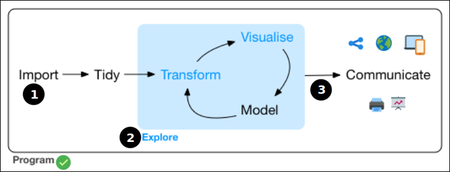

# Bienvenidos al curso!! :vulcan_salute::rose: {background-color="#abd2d6"}

# Contenidos/objetivo del curso {background-color="#b8c2aa"}

------------------------------------------------------------------------

### ¿Qué haremos en el curso? {.color-header}

. . .

- Aprender a **usar "el entorno R" (❗) para escribir**,   para hacer distintos tipos de documentos.

. . . 

- Documentos que espero sean útiles para nuestras labores docentes, investigadoras y de gestión. Por ejemplo: **tutoriales**, **transparencias**, **páginas web**, **blogs**, ...

. . .

-   Estos documentos serán **reproducibles**  (❗)

. . .

 

**¿Documentos reproducibles?**

. . .

-   Sí, generaremos directamente el documento final sin copiar ni pegar nada, sino **usando código**.

    -   Para ello, hemos de aprender a escribir en **QMD** (Quarto Markdown) (❗❗)

------------------------------------------------------------------------

### Forma de trabajar con el "entorno R"

-   **R es un entorno** (y un lenguaje de programación) **para hacer estadística**.

-   Podemos pensar que un **análisis con datos** tiene varias etapas.

-   En el curso nos centraremos en la última etapa etapa: la **presentación de los resultados**.

{#fig-01 fig-align="center" width="85%"}  

-   En 2022 esta tercera etapa se hacía con RMD, pero ahora se hace con **QMD**. (❗❗❗)

 

---

### ¿Qué tipo de documentos veremos?

-   Principalmente **tutoriales**, **transparencias**, **páginas web** y **blogs**, ...

. . . 

-   ... pero, Con Quarto se pueden generar **documentos de muchos tipos** (artículos académicos, libros, tesis, cartas, cuadros de mando, etc ... etc ...) **y formatos** (html, pdf, epub, docx, beamer, pptx, etc ... etc ...). 

. . . 

- Para verlo puedes visitar la [Quarto gallery](https://quarto.org/docs/gallery/){target="blank"}

 

. . . 

### Algunos ejemplos:

-   **Tutoriales**: por ejemplo [este](https://quarto-dev.github.io/quarto-gallery/page-layout/tufte.html){target="blank"} o [este](https://perezp44.github.io/web.Econometria.GADE/materiales/cuestionario_practicas.html){target="blank"} 

-   **Slides**: por ejemplo [estas](https://laderast.github.io/qmd_rmd/#/title-slide){target="blank"} o [estas](https://apreshill.github.io/palmerpenguins-useR-2022/#/title-slide){target="blank"}

-   **Páginas web**: por ejemplo [esta](https://nicar.r-journalism.com/), [esta](https://sta210-s22.github.io/website/){target="blank"} o [esta](https://www.mm218.dev/){target="blank"}

-   **Blogs**: por ejemplo [este](https://www.mrworthington.com/){target="blank"} o [este](https://blog.djnavarro.net/){target="blank"}

# Calendario {background-color="#b8c2aa"}

## Calendario

 

+-------------------------------+---------------------------------------------------------------+
| Día                           |                                                               |
+===============================+===============================================================+
|  26 de junio (lunes)          | Presentación (slides 01)    \                                 |
|                               | Primeros pasos (slides 02)   \                                |
|                               | Aprendiendo a escribir en QMD (slides 03)   \                 | 
|                               | Slides con Quarto (slides 04)    \                            |
+-------------------------------+---------------------------------------------------------------+
|  28 de junio (miércoles)      | Mi primer web/blog (slides 05)      \                         |
+-------------------------------+---------------------------------------------------------------+
|  3 de julio (lunes)           | Más cosas con Quarto (slides 06)      \                       |
+-------------------------------+---------------------------------------------------------------+

# Para conocermos un poco mejor {background-color="#b8c2aa"}

## Sobre mi (Pedro J. Pérez) {background-color="#abd2d6"}

-   Profesor en la UV (departamento de Análisis Económico) y **entusiasta de R**.

. . .

-   Web de mis cursos en 2022-23:

    -   [Econometría](https://perezp44.github.io/web.Econometria.GADE/){target="blank"}
    -   [Intro a la Ciencia de datos con R](https://perezp44.github.io/intro-ds-22-23-web/){target="blank"} (tenéis que ver [los trabajos de los estudiantes](https://perezp44.github.io/intro-ds-22-23-web/07-trabajos_2022-23.html){target="\"blank”"})
    -   [Curso de Introducción a R](https://perezp44.github.io/curso_R_SFPIE_2021/){target="blank"} (en el SFPIE).

. . .

-   No soy bloguero pero he impartido el **taller** [Mi primer blog con Quarto](https://perezp44.github.io/taller.primer.blog/){target="blank"} en las XII Jornadas de ususarios de R. Algunos de mis blogs:

    -   [2015, R & flowers](http://perezp44.github.io/){target="blank"} , con Jekyll
    -   [2018, R & flowers V](https://rflowers5.netlify.app/){target="\"blank”"}, con Hugo y blogdown
    -   [2020, R & flowers (o casi)](https://perezp44.github.io/my_blog_R-flowers-0.1.3/){target="\"blank”"}, con radix
    -   [2021, pedro.j.perez blog's](https://perezp44.github.io/pjperez.web/){target="\"blank”"}, con Distill
    -   [2022, R & flowers](https://perezp44.github.io/pjperez.blog.2022/){target="\"blank”"}, con Quarto

# Os toca presentaros!! :slightly_smiling_face: {background-color="#abd2d6"}

 

-   Nombre

-   Facultad/Departamento/Organismo/Servicio ...

-   Motivaciones y objetivos al apuntaros al curso

-   Experiencia con R y RStudio

-   Experiencia con Rmarkdown y Quarto

# Comenzamos el curso !!!! :computer::crossed_fingers: 💪🏼 💪🏼 {background-color="#562457"}
