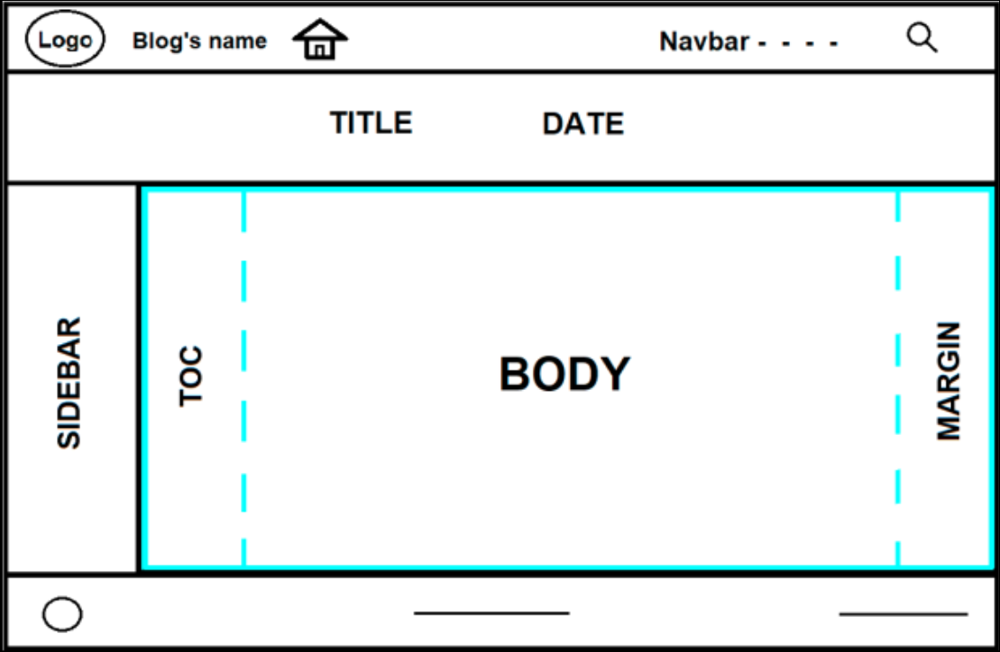

# Intro {background-color="#b8c2aa"}



<br>

. . .

- En el [I Congreso & XII Jornadas de Usuarios de R](http://r-es.org/12jr/) celebradas en Córdoba en noviembre de 2022 impartí el taller [Mi primer blog con Quarto](https://perezp44.github.io/taller.primer.blog/)

. . . 


- Buena parte de estas slides provienen del taller.


## Estructura del taller {.smaller}

<br>

0.  **Primeras ideas**, visionado de blogs

. . .

1.  Creación de un blog básico: mi blog en 3 minutos 

2.  **Tuneado básico** del blog. 

3.  Convirtiendo el blog en una **web personal** 

<br>

. . .

4.  Workflow: **creando posts** 

5.  **Escribiendo** un post **con Quarto** 

. . . 

<br>

6.  Tuneado: **mejorando la web**

. . .

7.  Gestión y **publicación** de la web/blog


<br>


## Objetivo(s) del taller

<br>

::: incremental
-   Aprender a **hacer websites/blogs con Quarto**

<br>

-   **Aprender sobre Quarto** mientras vamos creando una web/blog

<br>

-   Que salgáis todos con el bosquejo y la **intención de hacer** una web/blog!!

<br>

-   ... y, si puede ser, **pasar un buen rato** :slightly_smiling_face: mientras aprendemos
:::

## Beneficios de tener un blog {.smaller}

<br>

-   **Se aprende mucho!!**

. . .

-   Es **fácil** (pocas barreras de entrada si ya usas Rmarkdown)

-   Es **divertido**

. . .

-   Registrar análisis que haces que de otra forma olvidarías

-   Portafolio y contactos

. . .

-   Productive procrastination (!!)

. . .

(Discursos más elaborados [aquí](https://www.rebeccabarter.com/blog/2020-02-03_blogger/) o [aquí](https://jozef.io/r914-one-year-r-blogging/) )

. . .

<br>

### **Importante:**

-   El blog **no tiene que ser perfecto**. Mejor empezar con un blog sencillo

. . .

-   Los posts **tampoco tienen porqué estar perfectos**, así que no hay que tener miedo a escribir!!


# Primeras ideas {background-color="#b8c2aa"}



<br>


- Vamos a usar Quarto para **hacer un blog**

- En realidad un blog no es más que un tipo (especial) de web

<br>


## Estructura de una web { .unnumbered background-color="#b8c2aa" title-align="center"}


::: {columns}

::: {.column width="69%"}

:::


::: {.column width="30%"}


**HEADER/Navbar**

<br>

**TITLE-block banner**

<br><br><br>

[**ARTICLE**]{.purple}

<br><br><br><br>

**Footer**

:::

:::


## Ejemplos de blogs (hechos con Quarto) {.smaller}

-   [Mike Mahoney](https://www.mm218.dev/blog.html) (el repo [aqui](https://github.com/mikemahoney218/mm218.dev))

-   [Isabella Velásquez](https://ivelasq.rbind.io/about.html) (el repo [aqui](https://github.com/ivelasq/pipedream))

-   [Danielle Navarro](https://blog.djnavarro.net/) (el repo [aqui](https://github.com/djnavarro/quarto-blog))

-   [Jeff y Marc Dotson](https://occasionaldivergences.com/) (el repo [aqui](https://github.com/marcdotson/occasional-divergences))

-   [Layton R blog](https://graphdr.github.io/data-stories/) (el repo [aqui](https://github.com/graphdr/data-stories))

-   [R Lille](https://rlille.fr/) (el repo [aqui](https://github.com/RLille/rlille.fr))

-   [Drew Dimmery](https://ddimmery.com/)

-   [PA blog](https://www.paltmeyer.com/blog/) (el repo [aqui](https://github.com/pat-alt/pat-alt.github.io))

-   [Mario Angst](https://marioangst.com/en/)

-   [Matt Worthington](https://www.mrworthington.com/) (el repo [aqui](https://github.com/mrworthington/mrworthington.github.io))

<br>

#### Más opciones:

-   La [Gallery de Quarto](https://quarto.org/docs/gallery/#websites)


# 1. Creación de un blog básico con Quarto {background-color="#EEBF8B"}

(1ª parte del tutorial)



------------------------------------------------------------------------



------------------------------------------------------------------------

## Contenido del Qproject



Los **archivos importantes** ahora son 3:

-   `_quarto.yml`: especifica la estructura (y apariencia) de la web

-   `index.qmd` : generará (y dará formato) a la "landing page" o Home. Esta página será un listado de páginas (un blog)

-   `about.qmd` : una de la páginas del blog

<br>

------------------------------------------------------------------------





<br>

------------------------------------------------------------------------

## Contenido del Qproject (tras procesar el blog)



-   Se han creado 2 subcarpetas: `_site` y `_freeze`

-   `_site` es la carpeta que contiene el blog.

<br>

------------------------------------------------------------------------

## Ver el blog en local

-   `_site` es la carpeta que contiene el blog. Veamos su contenido

-   La página principal (o Home) de nuestro blog es el archivo `index.html`.

-   El archivo `index.html` ha sido generado por el fichero `index.qmd`.



<br>

------------------------------------------------------------------------

## Contenido de `index.qmd` {.smaller}

-   El archivo `index.qmd` genera `index.html`, la página principal (o Home) de nuestro blog



<br>

------------------------------------------------------------------------

## Alojando el blog



-   Puedes ver [aquí](https://pjperez.quarto.pub/blog_prueba_00/), como quedaría el blog una vez alojado en Internet.

<br>



<br>

------------------------------------------------------------------------



<br>


# 2. Tuneado básico del blog {background-color="#EEBF8B"}

(2ª parte del tutorial)



<br>

------------------------------------------------------------------------

## Archivo `_quarto.yml` {.smaller}



------------------------------------------------------------------------

## 



Además:

-   **lineas 17-19**: añadimos la página/pestaña "Docencia" a la izquierda de la navbar
-   **lineas 21-26**: modificamos el theme, ponemos TOC a los documentos, ..., **CSS**,

------------------------------------------------------------------------







------------------------------------------------------------------------

## Archivo `index.qmd`



-   De momento, **solo vamos a hacer cambios en la segunda linea**: cambiaremos el título.

-   Fíjate que es el título del listado de posts (del blog), no de la página web.

-   Fijaros que `index.qmd` es un archivo especial: "sólo tiene yaml". Es el que genera el listado de posts

<br>

------------------------------------------------------------------------



<br>

------------------------------------------------------------------------

## Archivo `about.qmd` {.smaller}



-   Si en el `yaml` se activa la opción `about:` (linea 4), entonces puedes usar unas **plantillas** que Quarto tiene disponibles para **crear About's pages**.

-   Como puedes ver [aquí](https://quarto.org/docs/websites/website-about.html#templates) hay **5 plantillas**: jolla, trestles, solana, marquee y broadside.

-   [Aquí](https://quarto.org/docs/websites/website-about.html) tienes la documentación oficial sobre estas plantillas.

<br>

------------------------------------------------------------------------



<br>

------------------------------------------------------------------------

## Archivo `styles.css`

-   Puedes cambiar la apariencia estética del blog usando los `themes` predefinidos en Quarto o puedes usar el archivo `styles.css`[^1]

[^1]: Veremos en el tutorial nº 6 que también podremos usar archivos `.scss`



<br>

------------------------------------------------------------------------



<br>

-   [Aquí](https://pjperez.quarto.pub/blog_pruebas_01/) puedes ver **como quedaría el blog** tras haber modificado `_quarto.yml`, `index.qmd`, `about.qmd` y `styles.css`.

------------------------------------------------------------------------

## Práctica (tutorial nº 2) {background-color="#D3F3E7"}

En esta sección dedicaremos un tiempo a la **práctica libre para que adaptes el blog a tus necesidades y gustos**. Por ejemplo puedes probar:

<br>

1.  Añadir una **nueva página a la web** (`quarto.yml`). Os doy una posibilidad en la siguiente slide

<br>

2.  Modificar la **apariencia del blog** (realmente del listado de posts) jugando con las opciones que nos proporciona Quarto (`index.qmd`). Gracias YAML inteligence!!

<br>

3.  Modificar la apariencia de la **página About** (`about.qmd`)

------------------------------------------------------------------------



------------------------------------------------------------------------



------------------------------------------------------------------------



<br>

# 3. Convertir el blog en web personal {background-color="#EEBF8B"}

(3ª parte del tutorial)



<br>

------------------------------------------------------------------------



------------------------------------------------------------------------



------------------------------------------------------------------------



------------------------------------------------------------------------



# 4. Workflow: ¿cómo crear un post? {background-color="#EEBF8B"}

(4ª parte del tutorial)



<br>

------------------------------------------------------------------------

## ¿Donde están los posts del blog?

-   Los ficheros `.qmd` que generan los posts están **en la carpeta `posts`** (de nuestro Qproject que genera el blog).

-   **Cada post** está en **una carpeta diferente**[^2]:

[^2]: No es necesario que los posts estén cada uno en una carpeta, pero me parece una buena práctica.



-   Veamos (en la siguiente slide) el contenido de `./posts/welcome/`

------------------------------------------------------------------------

## Contenido de cada subcarpeta de `./posts/`

<br>

-   Por ejemplo de `./posts/welcome/`



<br>

------------------------------------------------------------------------



------------------------------------------------------------------------



<br>

------------------------------------------------------------------------



<br>

# 5. Escribiendo posts: practicando con Quarto {background-color="#EEBF8B"}

(5ª parte del tutorial)





<br>

------------------------------------------------------------------------

## Ficheros `.qmd`

-   Los ficheros `.qmd` tienen **3 partes**: YAML, texto y chunks de código.



-   Veámoslas una a una

# 1. YAML {.unnumbered background-color="#b8c2aa"}

------------------------------------------------------------------------

## YAML: ideas importantes

<br>

-   El encabezamiento o **YAML** sirve para fijar **opciones y metadatos** de nuestro documento.

<br>

-   El `YAML` será procesado varias veces durante el procesado del documento: es leído por Quarto, knitr y Pandoc e **influirá en el output final**.

<br>

-   El hecho de estar trabajando dentro de un **Qproject** nos da **mucha versatilidad** a la hora de especificar el YAML de nuestros documentos `.qmd`. Documentación oficial [aquí](https://quarto.org/docs/projects/quarto-projects.html)

## El `yaml` de un post se puede especificar en **3 niveles** {background-color="#f7f5d2"}

<br>

1.  **Nivel proyecto**:todo Qproject tiene archivo `_quarto.yml`. Todo documento que se procese dentro del proyecto, heredará los metadatos definidos en `_quarto.yml`.

2.  **Nivel carpeta**: si en una carpeta existe un documento `_metadata.yml`, los documentos de esa carpeta heredan sus metadatos. La carpeta `./posts/` de un blog suele tener un archivo `_metadata.yml`.

3.  **Nivel documento**: En el yaml del propio documento `.qmd`

<br>

-   Si hay conflictos **prevalecen las opciones del nivel documento**, luego nivel carpeta y finalmente nivel proyecto.

-   **Documentación oficial** de Quarto con las **principales opciones** que se pueden fijar en el YAML para documentos html: [aquí](https://quarto.org/docs/output-formats/html-basics.html) y [aquí](https://quarto.org/docs/reference/formats/html.html)

------------------------------------------------------------------------

## YAML: tal como lo tenemos ahora {.smaller}



------------------------------------------------------------------------

## YAML: NIVEL PROYECTO (opciones en `_quarto.yml`) {.smaller}

En `_quarto.yml` se suelen poner opciones referentes a 3 aspectos:

::: panel-tabset
#### 1. Sobre el propio Qproject



<br>

-   linea 4: podemos elegir la carpeta de destino de nuestro blog
-   linea 5: podemos cambiar el render directory de los `.qmd`

<br>

Documentación oficial [aquí](https://quarto.org/docs/projects/quarto-projects.html).

#### 2. Estructura de la página web



<br>

Como ves, se añadirían elementos como:

-   lineas 28 a 37: se añade un pie de página al blog

-   lineas 24 y 25: Hemos añadido un elemento a la `navbar` concretamente el icono `Home`. La documentación oficial para elementos de navegación está [aquí](https://quarto.org/docs/websites/website-navigation.html)

-   linea 4: añadimos un favicon

-   lineas 5 y 6: el url de la web y del repo en Github

-   lineas 7-10: elementos de redes sociales. La documentación oficial para estos elementos esta [aquí](https://quarto.org/docs/websites/website-tools.html)

<br>

#### 3. Formato de salida de los documentos



<br>

En un blog/web el formato de salida es siempre `.html`; sin embargo podemos especificar otras opciones como por ejemplo sí los documentos (o páginas de la web, o post del blog) tienen un índice flotante, etc... Documentación oficial [aquí](https://quarto.org/docs/output-formats/html-basics.html) y [aquí](https://quarto.org/docs/reference/formats/html.html)
:::

------------------------------------------------------------------------

## Un ejemplo "completito" de `_quarto.yml` {.smaller}

Si quieres ver un documento `_quarto.yml` completito, ve [aquí](https://github.com/quarto-dev/quarto-web/blob/main/_quarto.yml). Pertenece a la [web de Quarto](https://quarto.org/docs/websites/).

<br>

::: columns
::: {.column width="48%"}
```{=html}
<iframe width="600px" height="400px" style="border:2px solid #dee2e6;" src="https://quarto.org/docs/guide/"></iframe>
```
:::

::: {.column width="48%"}

:::
:::

------------------------------------------------------------------------



------------------------------------------------------------------------

### YAML nivel carpeta

-   Abajo el, contenido del fichero `./posts/_metadata.yml` de nuestro blog



------------------------------------------------------------------------

### YAML nivel carpeta

<br>



------------------------------------------------------------------------

### YAML: nivel documento

<br>



# 2. TEXTO (o narrativas) {.unnumbered background-color="#b8c2aa"}

------------------------------------------------------------------------

### Texto (o narrativas) {.smaller}

-   Se escribe (al igual que `.Rmd`) en **markdown**. [Aquí](https://quarto.org/docs/authoring/markdown-basics.html) la documentación oficial de Quarto.

-   Sintaxis básica de `markdown`



# 3. CHUNKS {.unnumbered background-color="#b8c2aa"}

------------------------------------------------------------------------

### CHUNKS

**Comportamiento similar** a los documentos `.Rmd`. La documentación oficial está [aquí](https://quarto.org/docs/computations/execution-options.html)

<br>

##### Principales diferencias con .Rmd

-   En ficheros `.qmd`, **las opciones de los chunks se pueden especificar globalmente en el YAML** y a nivel individual en cada uno de los chunks.

-   En los **chunks individuales** ahora se se utiliza la **sintaxis YAML** (`key: value`) en lineas dentro del chunk que empiezan con `#|`. Por ejemplo:



------------------------------------------------------------------------

### CHUNKS

-   Las principales opciones son: **echo**, **eval**, **warning**, **error**, **output** e **include**. [Aquí](https://quarto.org/docs/computations/execution-options.html#output-options) la documentación oficial.

-   `echo`: además de los típicos true y false, ahora **incorpora un nuevo valor `fenced`** que facilita mostrar las marcas de los chunks en el documento final. Documentación [aquí](https://quarto.org/docs/computations/execution-options.html#fenced-echo).

-   Además, si usamos `knitr` para ejecutar los chunks, entonces podemos usar todas las [opciones nativas de `knitr`](https://yihui.org/knitr/options/), como: collapse, fig.width, comment, etc ... Más información [aquí](https://quarto.org/docs/computations/execution-options.html#knitr-options). Un ejemplo:





-   Hay **más opciones para los chunks**. Por ejemplo:

    -   hacer **folding code** con `#| code-fold: true`

    -   si el código es muy largo, puedes usar `#| code-overflow: wrap` o scroll

    -   puedes hacer que se muestren los **números de linea** con `#| code-line-numbers: true`

La documentación oficial la tienes [aquí](https://quarto.org/docs/output-formats/html-code.html).

# 4. Elementos básicos para escribir {.unnumbered background-color="#b8c2aa"}

------------------------------------------------------------------------

### Elementos básicos para escribir

<br>



# 5. Más elementos para "escribir" {.unnumbered background-color="#b8c2aa"}

------------------------------------------------------------------------

### Más elementos para "escribir"



# Veamos algunos de estos elementos con un poco de detalle. {.unnumbered background-color="#b8c2aa"}

<br><br>

(Después lo recordaremos con una Práctica)

------------------------------------------------------------------------



------------------------------------------------------------------------



<br>

------------------------------------------------------------------------



Las soluciones a la Práctica están [aquí](/posts/post_04_practica-05.html)

<br>

# 6. Tuneado del blog {background-color="#EEBF8B"}

(6ª parte del tutorial)



<br>

------------------------------------------------------------------------

## Intro

-   Quarto viene preparado con diferentes `Bootstrap themes` del [proyecto Bootswatch project](https://bootswatch.com/) que le dan a nuestro blog una apariencia profesional y cuidada.

<br>

-   Creo que es mejor **comenzar con un blog sencillo** usando las plantillas (o themes) que nos ofrece Quarto pero, si queremos modificar la apariencia de nuestro blog, podemos hacerlo de 3 formas:

    1.  Utilizando las opciones disponibles en Quarto para el `yaml`

    2.  Utilizando CSS

    3.  Utilizando SASS

# 1. Utilizando opciones del YAML {.unnumbered background-color="#b8c2aa"}

<br>

-   En el [tutorial nº 6](/taller/06_taller_tuneado-del-blog.html) repasamos las distintas opciones que tenemos disponibles para poder cambiar a través de opciones en los YAML's (recuerda los 3 niveles).

-   Aquí solo pondré la **documentación relevante** junta y **destacaré algunas de las opciones** disponibles.

------------------------------------------------------------------------

## Documentación oficial

##### (sobre opciones disponibles en los YAML's)

<br>

-   Referentes al **proyecto**: [aquí](https://quarto.org/docs/projects/quarto-projects.html#shared-metadata)

-   Referentes a la **estructura de la web**: [aquí](https://quarto.org/docs/websites/website-navigation.html) y [aquí](https://quarto.org/docs/websites/)

-   Referentes a la **estética**: [aquí](https://quarto.org/docs/output-formats/html-basics.html) y [aquí](https://quarto.org/docs/reference/formats/html.html)

-   Referentes a las **Listing Pages**: [aquí](https://quarto.org/docs/websites/website-listings.html)

-   Referentes a las **About Pages**: [aquí](https://quarto.org/docs/websites/website-about.html)

# Algunas opciones de YAML {.unnumbered background-color="#b8c2aa"}

------------------------------------------------------------------------

## Algunas opciones de YAML (**lang**)

-   Si te has fijado, los metadatos de los documentos aparecen en inglés.

-   Por ejemplo, pone "Author" en lugar de "Autor" o "Autora".

<br>

#### Hagamos algunos cambios

-   Si quisiéramos cambiar específicamente la opción de autor, tendríamos que poner en el YAML:

```{r}
#| eval: false
language: 
  title-block-author-single: "Autora"
```

-   Podemos cambiar todas las opciones especificando en el YAML `lang: es`.

-   La documentación oficial está [aquí](https://quarto.org/docs/authoring/language.html) y [aquí](https://github.com/quarto-dev/quarto-cli/blob/main/src/resources/language/_language.yml) todos los elementos que se pueden modificar. Y [aquí](https://github.com/quarto-dev/quarto-cli/tree/main/src/resources/language) los ficheros específicos para diferentes idiomas. [Aquí](https://github.com/quarto-dev/quarto-cli/blob/main/src/resources/language/_language-es.yml) el documento para el castellano.

<br>

-   Si quisieras usar tu propio documento tendrías que poner en el YAML: `language: custom.yml` (lógicamente el fichero `custom.yml` tendría que existir y estar en la ruta correcta).

-   ¿Probamos a hacerlo?

------------------------------------------------------------------------

## Otras opciones para tunear desde el YAML

-   **TOC**: es importante tenerlo a nuestro gusto. [Aquí](https://quarto.org/docs/reference/formats/html.html#table-of-contents) tienes las opciones que puedes ajustar con opciones en el yaml

-   **Chunks**: [aquí](https://quarto.org/docs/reference/formats/html.html#code) tienes las opciones que puedes ajustar desde el YAML

-   **Resizing de los thumbnails**. Un [gist](https://gist.github.com/perezp44/fc5a3853039fd29ff94c5b8488fea0a1#file-resize_thumbnails-r) para hacerlo.

-   **Algunas opciones de tuneado** que puedes implementar desde el YAML. Prueba a poner estas opciones en el archivo `_quarto.yml`. Nuestro blog **empeorará bastante**. Más opciones [aquí](https://quarto.org/docs/output-formats/html-themes.html#basic-options).

```{r, eval = FALSE}
fontcolor: green          #- color del texto
linkcolor: purple         #- color de los enlaces
monobackgroundcolor: red  #- color de los cuadros de resultados de evaluar código
fontsize: 0.6em           #- tamaño del texto (más pequeño de lo normal: 1)
linestretch: 2.3          #- tamaño entre las lineas (1.6 es lo "normal")
```

# 2. Utilizando CSS {.unnumbered background-color="#b8c2aa"}

<br>

-   La apariencia visual del blog puede cambiarse utilizando CSS.

-   Veamos un ejemplo con el siguiente [post](/posts/post_05_css.html)

# 3. Utilizando SASS {.unnumbered background-color="#b8c2aa"}

-   La documentación oficial [aquí](https://quarto.org/docs/output-formats/html-themes.html#sass-variables)

-   [Aquí](https://quarto.org/docs/output-formats/html-themes-more.html) la documentación oficial de Quarto sobre los Bootswatch Sass Theme Files.

-   Bootstrap define unas 1.400 variables con las que controlar fuentes, colores, etc ... . Puedes verlas [aquí](https://github.com/twbs/bootstrap/blob/main/scss/_variables.scss)

-   [Aquí](https://github.com/quarto-dev/quarto-cli/tree/main/src/resources/formats/html/bootstrap/themes) están los ficheros `.scss` de los 25 built-in Bootswatch themes.

<br>

-   **Otras referencias**, por ejemplo: [Customizing Quarto Websites: Make your website stand out using SASS](https://ucsb-meds.github.io/customizing-quarto-websites/#/title-slide) o [este video](https://www.youtube.com/watch?v=ErRX8plZpQE)

-   Tengo una "práctica" en el [tutorial nº 6](../taller/06_taller_tuneado-del-blog.html) del taller.

# Publicando el blog {.unnumbered background-color="#b8c2aa"}

<br>

-   La [documentación oficial](https://quarto.org/docs/publishing/) de Quarto.

-   Si lo publicamos en [Quarto Pub](https://quarto.org/docs/publishing/quarto-pub.html), ejecutar en la Terminal: `quarto publish quarto-pub`

-   En [Github Pages](https://quarto.org/docs/publishing/github-pages.html)

# Fin!! {.unnumbered .centered background-color="#562457"}

-   Muchas gracias por la atención :slightly_smiling_face:

-   Espero que el taller haya salido OK :white_check_mark:

-   Si alguien motivado por el taller acaba haciéndose un blog, **please que me avise** (pedro.j.perez\@uv.es) :mailbox:

<br>

-   Big thanks to all the Posit/Quarto team !!!! 👏🏼👏🏼 🙌🏼

<br>

-   Bye 👋🏼 👋🏼 , nos vemos en las próximas Jornadas en ...
