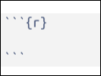
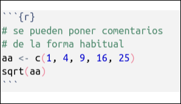
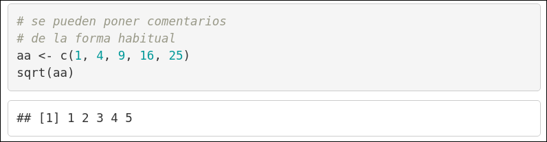
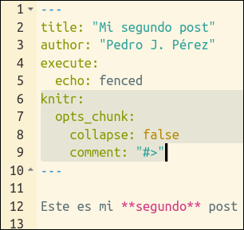
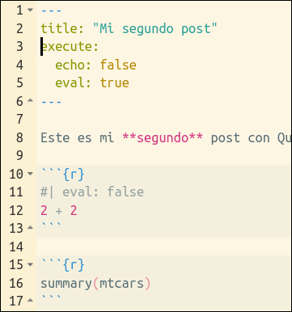
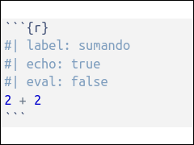
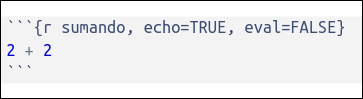
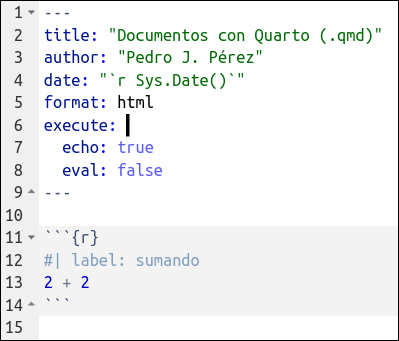
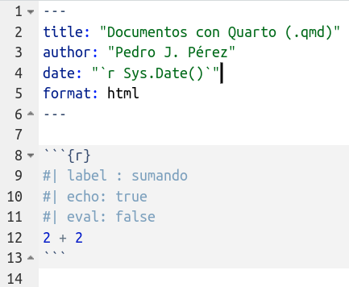

# Lo que ya sabemos {background-color="#b8c2aa"}



<br>

. . .

1.  Trabajamos con Qprojects

2. Documento fuente escrito en Qmd

2.  Genera diferentes outputs


# Lo que ya sabemos {background-color="#ebf5fb"}



<br>

. . .

1.  Trabajamos con Qprojects

2. Documento fuente escrito en Qmd

2.  Genera diferentes outputs


# ¿Qué es Quarto? {.unnumbered background-color="#ebf5fb"}




> Quarto is a multi-language, next generation version of R Markdown, with many new features and capabilities.

. . .

<br>

Permite incorporar texto y código para producir documentos (reproducibles) en multiples formatos

<br>

Puedes ver [este video](https://www.youtube.com/watch?v=_20US068pzk) de 100 segundos


# ¿Qué es Quarto? {.unnumbered background-color="#b8c2aa"}


> Quarto is a multi-language, next generation version of R Markdown, with many new features and capabilities.

. . .


<br>

Puedes ver [este video](https://www.youtube.com/watch?v=_20US068pzk) de 100 segundos

## ¿Qué es Quarto?

<br>

. . .

-   Un **nuevo sistema de publicación científica y técnica** de código abierto basado en Pandoc

. . .

-   Es ... la "**segunda generación de Rmarkdown**"


. . .

-   Muy **parecido a Rmarkdown**, pero ... **no requiere R**. Soporta lenguajes como Phyton, Julia y Observable.


-   Quarto utiliza Knitr para ejecutar el código R; así que es **capaz de procesar también los ficheros .Rmd** sin modificarlos


. . .

-  Quarto  **unifica funcionalidades** de varios paquetes del entorno Rmd como xaringan, bookdown, blogdown , ...


. . .

-   Quarto no es un paquete, **es un programa independiente**, un CLI


<br>


::: {.callout-tip collapse="true" icon="true"}
##### Ventajas de Quarto [Opcional]

-   Proyecto en [desarrollo activo](https://quarto.org/docs/download/) ... mientras que Rmarkdown [it's not going away](https://yihui.org/en/2022/04/quarto-r-markdown/) pero ...

-   **Unifica** algunas de las funcionalidades de Rmarkdown

-   **Por ejemplo**: Cross references, Call-outs, Advanced Layout (tb para imágenes), Extensiones, Interactividad, YAML inteligence, Quarto Pub, Divs, Spans

-   Para ver si estas ventajas merecen la pena para ti puedes leer a [Occasional Divergences](https://occasionaldivergences.com/posts/quarto-questions/#what-are-the-benefits-of-using-quarto-for-_____), [Nick Tierney](https://www.njtierney.com/post/2022/04/11/rmd-to-qmd/), [Alison Hill](https://www.apreshill.com/blog/2022-04-we-dont-talk-about-quarto/), [Danielle Navarro](https://blog.djnavarro.net/posts/2022-04-20_porting-to-quarto/), o [esta pregunta](https://stackoverflow.com/questions/72089640/what-are-the-benefits-of-using-quarto-over-rmarkdown) de Stack Overflow.


```{r}
#| eval: false
#::: {.smaller width="67%"}
#
#:::
```


:::

<br>

::: {.callout-tip collapse="true" icon="true"}

##### ¿Qué es Rmarkdown? ¿Para qué sirve? [Opcional]

- El predecesor de Quarto

-   Un ["entorno"](https://vimeo.com/178485416) para hacer informes/publicaciones/transparencias **REPRODUCIBLES** con R.

> Is an authoring framework for data science, combining your code, its results, and your prose. R Markdown documents are fully reproducible and support dozens of output formats, like PDFs, Word files, slideshows, and more.


-   Con Rmd se pueden generar **multitud de outputs**. Por ejemplo, visita [está galería](https://rmarkdown.rstudio.com/gallery.html) o [este listado](https://rmarkdown.rstudio.com/formats.html)

<br>


#### Una oda a Rmarkdown

-   [How Rmarkdown changed my life](https://www.youtube.com/watch?v=_D-ux3MqGug&list=PLXKlQEvIRus-qu1hjc8SyElSamAcT-KaE&index=6): charla de Rob Hyndman sobre su proceso hasta llegar a usar Rmarkdown para hacer sus documentos científicos y webs.

:::

---

## Para poder practicar lo que vayamos aprendiendo ... {background-color="#f7f8f5"}

<br><br>




# Qmarkdown: guía rápida (`.qmd`) {background-color="#b8c2aa"}

------------------------------------------------------------------------

## Los documentos `.qmd` tienen 3-4 partes {.smaller}

1.  Encabezamiento (**yaml** header)  
2.  Trozos de **código** R (R chunks)  
3.  **Texto** (escrito en Markdown) ... 

      ... y **todo lo demás**: imágenes, links, ecuaciones, etc ...  

<br>

. . .

### Un ejemplo

::: {columns}
::: {.column width="48%"}
#### source code

```{r echo = FALSE, comment = "",  out.width = '120%', fig.align = 'center'}
knitr::include_graphics(here::here("slides", "imagenes",  "ss_02_img_01.png") )
```
:::

::: {.column width="48%"}
#### output

```{r echo = FALSE, comment = "", out.width = '90%', fig.align = 'center'}
knitr::include_graphics(here::here("slides", "imagenes",  "ss_02_img_01b.png") )
```
:::
:::


<br><br>

------------------------------------------------------------------------

##### (I) El encabezamiento o "yaml header"

-   Se (suele) poner al ppio del documento, entre estas marcas: **`---`**

-   En el yaml son MUY importantes los **espacios y la indentación**

-   Puedes aprender más sobre el `yaml` en el [manual de Pandoc](https://pandoc.org/MANUAL.html)

##### Ejemplos de yaml

::: {.panel-tabset}

#### ejemplo 1

```{yaml}
---
title: "Mi primer archivo qmd"
date: "2023-08-08"
format: html
---
```


#### ejemplo 2

```{yaml}
---
title: "Mi primer archivo qmd"
date: "2023-08-08"
format:
  html:
    toc: true
    toc-location: left
---
```


#### ejemplo 3

```{yaml}
---
title: "Mi primer archivo qmd"
date: "2023-08-08"
format:
  html:
    toc: true
    toc-location: left
theme: sketchy
embed-resources: true
---
```
:::

. . .

<br>




------------------------------------------------------------------------

### (II) Code Blocks o chunks (código R)

-   Para que `knitr` sepa qué partes del `qmd` es **código R**, deben ir dentro de estas marcas:


{fig-align="left" width="15%"}

-   Por ejemplo:

{fig-align="left" width="30%"}

-   Cuando `knitr` procese el chunk, lo interpretará como código R y **ejecutará las instrucciones y mostrará en el documento final el output** generado por el chunk.

{fig-align="left" width="80%"}

<br><br>

-----------------------

### (II) Chunks: opciones

- Los chunks pueden tener opciones. La documentación oficial está [aquí](https://quarto.org/docs/computations/execution-options.html)


-   Las principales opciones son: **echo**, **eval**, **warning**, **error**, **output** e **include**. [Aquí](https://quarto.org/docs/computations/execution-options.html#output-options) la documentación oficial.

-   `echo`: además de los típicos true y false, ahora **incorpora un nuevo valor `fenced`** que facilita mostrar las marcas de los chunks en el documento final. Documentación [aquí](https://quarto.org/docs/computations/execution-options.html#fenced-echo).

-   Además, si usamos `knitr` para ejecutar los chunks, entonces podemos usar todas las [opciones nativas de `knitr`](https://yihui.org/knitr/options/), como: collapse, fig.width, comment, etc ... Más información [aquí](https://quarto.org/docs/computations/execution-options.html#knitr-options). Un ejemplo:  

{fig-align="center"}


-   Hay **más opciones para los chunks**. Por ejemplo:

    -   hacer **folding code** con `#| code-fold: true`

    -   si el código es muy largo, puedes usar `#| code-overflow: wrap` o  scroll

    -   puedes hacer que se muestren los **números de linea** con `#| code-line-numbers: true`

La documentación oficial la tienes [aquí](https://quarto.org/docs/output-formats/html-code.html).


<br>

##### Principales diferencias con .Rmd

-   En ficheros `.qmd`, **las opciones de los chunks se pueden especificar globalmente en el YAML** y a nivel individual en cada uno de los chunks.

-   En los **chunks individuales** ahora se se utiliza la **sintaxis YAML** (`key: value`) en lineas dentro del chunk que empiezan con `#|`. Por ejemplo:

{fig-align="center"}

------------------------------------------------------------------------

### (IIb) Chunks: diferencias entre Quarto y Rmd

-   Ahora se usa **YAML** style (`echo: false`).

-   **Cada opción va en una linea** que empieza por el "hash pipe": `#|`

::: columns

::: {.column width="46%"}
##### .qmd

{fig-align="left" width="100%"}
:::

::: {.column width="46%"}
#### .Rmd

{fig-align="left" width="100%"}
:::


:::

<br>


------------------------------------------------------------------------

### (IIc) Chunks: diferencias con Quarto

-   **No hace falta chunk inicial**: con Quarto se pueden poner **las opciones de chunk en el YAML**

::: columns
::: {.column width="46%"}
#### .Qmd (chunk options en yaml)

{fig-align="left" width="100%"}
:::

::: {.column width="46%"}
##### .Qmd

{fig-align="left" width="100%"}
:::
:::


------------------------------------------------------------------------

## (III) Texto (narrativa)

- "Todo" lo que no es `YAML` o `CHUNKS` de código, es **TEXTO**.

- El texto **se escribe en Markdown** (concretamente en [Pandoc's Markdown](https://pandoc.org/MANUAL.html#pandocs-markdown))

- Documentación oficial de Quarto [aquí](https://quarto.org/docs/authoring/markdown-basics.html)

<br>

### Sintaxis básica de `markdown`

-   Documentación oficial de Quarto [aquí](https://quarto.org/docs/authoring/markdown-basics.html): puedes ver (o recordar) la sintaxis básica para escribir en `markdown`. Como ejemplo:


```{r echo = FALSE, comment = "",  out.width = '100%', fig.align = 'center'}
knitr::include_graphics(here::here("slides", "imagenes",  "ss_03_img_06_sintaxis-markdown.png") )
```


--------------------


Has de mirar esta referencia para explicar MD: <https://www.markdownguide.org/getting-started/>

- Y la docu oficial  <https://quarto.org/docs/authoring/markdown-basics.html> y su **source**: <https://github.com/quarto-dev/quarto-web/blob/main/docs/authoring/markdown-basics.qmd>

----------------

## Un podo de historia, ¿q es Markdoww?

- Markdown es un lenguaje de marcado ligero (!!) con sintaxis sencilla que permite dar formato y estructura a un texto y convertirlo a .html, .pdf ...

- Fue creado por John Grueber  y Aaron Swwatch en 2004

  > Markdown is a text-to-HTML conversion tool for web writers.

- Se creo con el objetivo de crear  un formato de texto fácil de escribir y leer

- Quarto is based on Pandoc and uses its variation of markdown as its underlying document syntax. Pandoc markdown is an extended and slightly revised version of John Gruber’s Markdown syntax

<https://pandoc.org/MANUAL.html#pandocs-markdown>

<https://daringfireball.net/projects/markdown/>

-----------------

### Sintaxis básica de `markdown`

## Párrafos

- A paragraph is one or more lines of text followed by one or more blank lines. Newlines are treated as spaces, so you can reflow your paragraphs as you like. 

- Si necesitas a hard line break dentro de un párrafo, put two or more spaces at the end of a line. Tb se puede hacer con A backslash followed by a newline is also a hard line break

- Note: in multiline and grid table cells, this is the only way to create a hard line break, since trailing spaces in the cells are ignored.

- Para crear un nuevo párrafo hay que dejar al menos una linea de espacio

- [Underline]{.underline}

[Small caps]{.smallcaps}


## Formateo del texto

+-----------------------------------+-------------------------------+
| Markdown Syntax                   | Output                        |
+===================================+===============================+
|     texto normal                  | texto normal                  |
+-----------------------------------+-------------------------------+
|     texto en **negrita**          | texto en **negrita**          |
+-----------------------------------+-------------------------------+
|     texto en *cursiva*            | texto en *cursiva*            |
+-----------------------------------+-------------------------------+
|     un superíndice^2^             | un superíndice^2^             |
+-----------------------------------+-------------------------------+
|     un subíndice~2~               | un subíndice~2~               |
+-----------------------------------+-------------------------------+
|     palabras ~~tachadas~~         | palabras ~~tachadas~~         |
+-----------------------------------+-------------------------------+
|     `verbatim code`               | `verbatim code`               |
+-----------------------------------+-------------------------------+

## Títulos 

+---------------------+-----------------------------------+
| Markdown Syntax     | Output                            |
+=====================+===================================+
|     # Header 1      | # Header 1                        |
+---------------------+-----------------------------------+
|     ## Header 2     | ## Header 2                       |
+---------------------+-----------------------------------+
|     ### Header 3    | ### Header 3 {.heading-output}    |
+---------------------+-----------------------------------+
|     #### Header 4   | #### Header 4 {.heading-output}   |
+---------------------+-----------------------------------+
|     ##### Header 5  | ##### Header 5 {.heading-output}  |
+---------------------+-----------------------------------+
|     ###### Header 6 | ###### Header 6 {.heading-output} |
+---------------------+-----------------------------------+

```{=html}
<style type="text/css">
.heading-output {
  border-bottom: none;
  margin-top: 0;
  margin-bottom: 0;
}
</style>
```
## Links & Images

+------------------------------------------------------------------+--------------------------------------------------------------------------------------------------------+
| Markdown Syntax                                                  | Output                                                                                                 |
+==================================================================+========================================================================================================+
|     <https://quarto.org>                                         | <https://quarto.org>                                                                                   |
+------------------------------------------------------------------+--------------------------------------------------------------------------------------------------------+
|     [Quarto](https://quarto.org)                                 | [Quarto](https://quarto.org)                                                                           |
+------------------------------------------------------------------+--------------------------------------------------------------------------------------------------------+
|                                          | {fig-alt="A line drawing of an elephant."}                                     |
+------------------------------------------------------------------+--------------------------------------------------------------------------------------------------------+
|     [](https://quarto.org)               | [](https://quarto.org)                                                         |
+------------------------------------------------------------------+--------------------------------------------------------------------------------------------------------+
|     [](https://quarto.org "An elephant") | [{fig-alt="A line drawing of an elephant."}](https://quarto.org) |
+------------------------------------------------------------------+--------------------------------------------------------------------------------------------------------+
|     [{fig-alt="Alt text"}](https://quarto.org)  | [{fig-alt="A line drawing of an elephant."}](https://quarto.org)                      |
+------------------------------------------------------------------+--------------------------------------------------------------------------------------------------------+

## Lists

+-------------------------------------+---------------------------------+
| Markdown Syntax                     | Output                          |
+=====================================+=================================+
|     * unordered list                | -   unordered list              |
|         + sub-item 1                |                                 |
|         + sub-item 2                |     -   sub-item 1              |
|             - sub-sub-item 1        |                                 |
|                                     |     -   sub-item 2              |
|                                     |                                 |
|                                     |         -   sub-sub-item 1      |
+-------------------------------------+---------------------------------+
|     *   item 2                      | -   item 2                      |
|                                     |                                 |
|         Continued (indent 4 spaces) |     Continued (indent 4 spaces) |
+-------------------------------------+---------------------------------+
|     1. ordered list                 | 1.  ordered list                |
|     2. item 2                       |                                 |
|         i) sub-item 1               | 2.  item 2                      |
|              A.  sub-sub-item 1     |                                 |
|                                     |     i)  sub-item 1              |
|                                     |                                 |
|                                     |         A.  sub-sub-item 1      |
+-------------------------------------+---------------------------------+
|     (@)  A list whose numbering     | (1) A list whose numbering      |
|                                     |                                 |
|     continues after                 | continues after                 |
|                                     |                                 |
|     (@)  an interruption            | (2) an interruption             |
+-------------------------------------+---------------------------------+
|     term                            | term                            |
|     : definition                    |                                 |
|                                     | :   definition                  |
+-------------------------------------+---------------------------------+

## Tables

#### Markdown Syntax

    | Right | Left | Default | Center |
    |------:|:-----|---------|:------:|
    |   12  |  12  |    12   |    12  |
    |  123  |  123 |   123   |   123  |
    |    1  |    1 |     1   |     1  |

#### Output

| Right | Left | Default | Center |
|------:|:-----|---------|:------:|
|    12 | 12   | 12      |   12   |
|   123 | 123  | 123     |  123   |
|     1 | 1    | 1       |   1    |

Learn more in the article on [Tables](tables.qmd).

## Source Code

Use ```` ``` ```` to delimit blocks of source code:

```` markdown
```
code
```
````

Add a language to syntax highlight code blocks:

```` markdown
```python
1 + 1
```
````

Pandoc supports syntax highlighting for over [140 different languages](https://github.com/jgm/skylighting/tree/master/skylighting-core/xml). If your language is not supported then you can use the `default` language to get a similar visual treatment:

```` markdown
```default
code
```
````

If you are creating HTML output there is a wide variety of options available for code block output. See the article on [HTML Code](../output-formats/html-code.qmd) for additional details.

## Equations

Use `$` delimiters for inline math and `$$` delimiters for display math. For example:

+-------------------------------+-------------------------+
| Markdown Syntax               | Output                  |
+===============================+=========================+
|     inline math: $E = mc^{2}$ | inline math: $E=mc^{2}$ |
+-------------------------------+-------------------------+
|     display math:             | display math:\          |
|                               | $$E = mc^{2}$$          |
|     $$E = mc^{2}$$            |                         |
+-------------------------------+-------------------------+

If you want to define custom TeX macros, include them within `$$` delimiters enclosed in a `.hidden` block. For example:

``` tex
::: {.hidden}
$$
 \def\RR{{\bf R}}
 \def\bold#1{{\bf #1}}
$$
:::
```

For HTML math processed using [MathJax](https://docs.mathjax.org/) (the default) you can use the `\def`, `\newcommand`, `\renewcommand`, `\newenvironment`, `\renewenvironment`, and `\let` commands to create your own macros and environments.


## Resto: tablas, divs etc ...  


## mas elementos para escribir (layout, CSS)  


## Práctica: un tutorial  