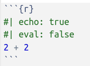
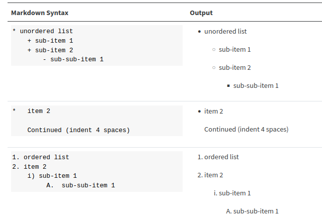

# Lo que ya sabemos {background-color="#b8c2aa"}



<br>

. . .

-   Trabajamos con Qprojects

-   Documento fuente escrito en **Qmd** genera diferentes outputs

# ¿Qué es Quarto? {.unnumbered background-color="#ebf5fb"}



> Quarto is a multi-language, next generation version of R Markdown, with many new features and capabilities.

. . .

<br>

Puedes ver [este video](https://www.youtube.com/watch?v=_20US068pzk) de 100 segundos

## ¿Qué es Quarto?

. . .

-   Un **nuevo sistema de publicación científica y técnica** de código abierto basado en Pandoc

. . .

-   Permite incorporar **texto y código** para producir documentos (reproducibles) en multiples formatos

. . .

-   Es ... la "**segunda generación de Rmarkdown**"

. . .

-   Muy **parecido a Rmarkdown**, pero ... **no requiere R**. Soporta lenguajes como Phyton, Julia y Observable.

-   Quarto utiliza Knitr para ejecutar el código R; así que es **capaz de procesar también los ficheros .Rmd** sin modificarlos

. . .

-   Quarto **unifica funcionalidades** de varios paquetes del entorno Rmd como xaringan, bookdown, blogdown , ...

. . .

-   Quarto no es un paquete, **es un programa independiente**, un CLI

<br>

::: {.callout-tip collapse="true" icon="true"}
##### Ventajas de Quarto \[Opcional\]

-   Proyecto en [desarrollo activo](https://quarto.org/docs/download/) ... mientras que Rmarkdown [it's not going away](https://yihui.org/en/2022/04/quarto-r-markdown/) pero ...

-   **Unifica** algunas de las funcionalidades de Rmarkdown

-   **Por ejemplo**: Cross references, Call-outs, Advanced Layout (tb para imágenes), Extensiones, Interactividad, YAML inteligence, Quarto Pub, Divs, Spans

-   Para ver si estas ventajas merecen la pena para ti puedes leer a [Occasional Divergences](https://occasionaldivergences.com/posts/quarto-questions/#what-are-the-benefits-of-using-quarto-for-_____), [Nick Tierney](https://www.njtierney.com/post/2022/04/11/rmd-to-qmd/), [Alison Hill](https://www.apreshill.com/blog/2022-04-we-dont-talk-about-quarto/), [Danielle Navarro](https://blog.djnavarro.net/posts/2022-04-20_porting-to-quarto/), o [esta pregunta](https://stackoverflow.com/questions/72089640/what-are-the-benefits-of-using-quarto-over-rmarkdown) de Stack Overflow.

```{r}
#| eval: false
#::: {.smaller width="67%"}
#
#:::
```
:::

<br>

::: {.callout-tip collapse="true" icon="true"}
##### ¿Qué es Rmarkdown? ¿Para qué sirve? \[Opcional\]

-   El predecesor de Quarto

-   Un ["entorno"](https://vimeo.com/178485416) para hacer informes/publicaciones/transparencias **REPRODUCIBLES** con R.

> Is an authoring framework for data science, combining your code, its results, and your prose. R Markdown documents are fully reproducible and support dozens of output formats, like PDFs, Word files, slideshows, and more.

-   Con Rmd se pueden generar **multitud de outputs**. Por ejemplo, visita [está galería](https://rmarkdown.rstudio.com/gallery.html) o [este listado](https://rmarkdown.rstudio.com/formats.html)

<br>

#### Una oda a Rmarkdown

-   [How Rmarkdown changed my life](https://www.youtube.com/watch?v=_D-ux3MqGug&list=PLXKlQEvIRus-qu1hjc8SyElSamAcT-KaE&index=6): charla de Rob Hyndman sobre su proceso hasta llegar a usar Rmarkdown para hacer sus documentos científicos y webs.
:::

------------------------------------------------------------------------

## Para poder practicar lo que vayamos aprendiendo ... {background-color="#f7f8f5"}

<br><br>



# Qmarkdown: guía rápida (`.qmd`) {background-color="#b8c2aa"}

------------------------------------------------------------------------

## Los documentos `.qmd` tienen 3-4 partes {.smaller}

1.  Encabezamiento (**yaml** header)\

2.  Trozos de **código** R (R chunks)\

3.  **Texto** (escrito en Markdown) ...

    ... y **todo lo demás**: imágenes, links, ecuaciones, etc ...

<br>

. . .

### Un ejemplo

::: {columns}
::: {.column width="48%"}
#### source code

```{r echo = FALSE, comment = "",  out.width = '120%', fig.align = 'center'}
knitr::include_graphics(here::here("slides", "imagenes",  "ss_02_img_01.png") )
```
:::

::: {.column width="48%"}
#### output

```{r echo = FALSE, comment = "", out.width = '90%', fig.align = 'center'}
knitr::include_graphics(here::here("slides", "imagenes",  "ss_02_img_01b.png") )
```
:::
:::

<br><br>

# (I): YAML {.unnumbered background-color="#ebf5fb"}



<br>

. . .

-   Se utiliza para especificar metadatos (opciones) del documento final


------------------------------------------------------------------------

### (I) El encabezamiento o "yaml header"

-   Se (suele) poner al ppio del documento, entre estas marcas: **`---`**

-   En el yaml son MUY importantes los **espacios y la indentación**


<br>

##### Ejemplos de yaml

::: panel-tabset
#### ejemplo 1

```{yaml}
---
title: "Mi primer archivo qmd"
date: "2023-08-08"
format: html
---
```

#### ejemplo 2

```{yaml}
---
title: "Mi primer archivo qmd"
date: "2023-08-08"
format:
  html:
    toc: true
    toc-location: left
---
```

#### ejemplo 3

```{yaml}
---
title: "Mi primer archivo qmd"
date: "2023-08-08"
format:
  html:
    toc: true
    toc-location: left
theme: sketchy
embed-resources: true
---
```
:::


<br>




- Veremos más opciones de YAML cuando veamos la creación de páginas web

<br>

# (II): CHUNKS {.unnumbered background-color="#ebf5fb"}



<br>

. . .

-   En documentos `.qmd` **podemos incorporar código**

-   Código que puede ser ejecutado para **mostrar los resultados** en el documento `.qmd`

. . . 

-   Esto es lo que permite que los documentos sean **reproducibles**


-   La documentación oficial está [aquí](https://quarto.org/docs/computations/execution-options.html)

------------------------------------------------------------------------

### (II) Code Blocks o chunks (código R)

-   Para que Quarto sepa qué partes del `.qmd` es **código R**, debe ir dentro de estas marcas:

{fig-align="left" width="15%"}

-   Por ejemplo:

{fig-align="left" width="30%"}

-   Cuando Quarto/`knitr` procesen el chunk, se interpretará como código R y **ejecutará las instrucciones**, de forma que, en el documento final,  se **mostrará  el output** generado por el chunk.

{fig-align="left" width="80%"}

<br><br>

------------------------------------------------------------------------

### (II) Chunks: los chunks pueden tener opciones.

-   Las principales opciones son: 

| Opción | (valor por defecto) | ¿Que hace? |
|----|-------|------------------|
| `echo` |  true |  Incluye el código en el documento final  |
| `eval` |  true | Evalúa el código     |
| `output` | true     | Incluye el resultado de la evaluación del código |
| `warning` |  true    | Incluye los avisos en el documento final |
| `message`   |  true    | Incluye los mensajes  |
| `error`   |  false    | Si pones `true`, se mostrarán los errores (!!!!) |
| `include`   |  true    |  |


 
 <br>
 
-  Por ejemplo:  





``` {{r}}
#| echo: true
#| eval: false
2 + 2
```                                                                                                             
<br><br>

##### Chunks: más detalles sobre las principales opciones


-   `include`: si en un chunk pones `#| include: false`, el código de ese chunk **se ejecutará pero no se mostrará nada**, ni el código, ni el resultado, ni mensajes, ni errores. Esta opción es útil, por ejemplo, para cargar los paquetes de R.

-   `echo`: además de los típicos true y false, ahora **incorpora un nuevo valor `#| echo: fenced`** que facilita mostrar las marcas de los chunks en el documento final. Documentación [aquí](https://quarto.org/docs/computations/execution-options.html#fenced-echo).


<br>




------------------------------------------------------------------------

### (II) Chunks: opciones de los chunks en el YAML

- En el YAML, podemos fijar los valores por defecto de las opciones de los chunks

- Por ejemplo: 


::: {columns}
::: {.column width="46%"}
##### .Qmd (chunk options en el chunk)

{fig-align="left" width="100%"}

:::

::: {.column width="46%"}
#### .Qmd (chunk options en el yaml)

{fig-align="left" width="100%"}
::: 
:::

<br>

------------------------------------------------------------------------

### (II) Chunks: Más opciones de `knitr`

- Si usamos `knitr` para ejecutar los chunks entonces, podemos usar todas las [opciones nativas de `knitr`](https://yihui.org/knitr/options/), como: collapse, fig.width, comment, etc ... Más información [aquí](https://quarto.org/docs/computations/execution-options.html#knitr-options). Un ejemplo:

{fig-align="center"}

- Si quieres ver todas las opciones disponibles para los chunks en `knitr` tendrás que ir a la [página web de knitr](https://yihui.name/knitr/options/), a la [cheat sheet sobre Rmarkdown](https://raw.githubusercontent.com/rstudio/cheatsheets/master/rmarkdown-2.0.pdf), o a la [Reference Guide](https://www.rstudio.com/wp-content/uploads/2015/03/rmarkdown-reference.pdf)

<br>

------------------------------------------------------------------------

### (II) Chunks: otras opciones

<br>

Ahora, en Quarto, hay **más opciones para los chunks**. Por ejemplo:

  - Hacer **folding code** con `#| code-fold: true`  
  
  - Si el código es muy largo, puedes usar `#| code-overflow: wrap` o  scroll

  - Puedes hacer que se muestren los **números de linea** con `#| code-line-numbers: true`

<br>

La documentación oficial la tienes [aquí](https://quarto.org/docs/output-formats/html-code.html) y [aquí](https://quarto.org/docs/reference/cells/cells-knitr.html#code-output)


<br>


------------------------------------------------------------------------

### (II) "Chunks": inline code


- La mayoría del código suele ir en los chunks, pero a veces necesitamos <span style="background-color: #e5e5e5; border-radius: 3px; padding: 4px; font-family: 'Source Code Pro', 'Lucida Console', Monaco, monospace;"><code> inline code </code></span> ; es decir, código R dentro de nuestro texto.

. . . 

<br>

- Por ejemplo, si quiero describir un df puedo hacerlo así: 

    - "El data.frame iris  tiene 150 filas y 5 variables" 

<br>

- Pero es mejor hacerlo con  <span style="background-color: #e5e5e5; border-radius: 3px; padding: 4px; font-family: 'Source Code Pro', 'Lucida Console', Monaco, monospace;"><code> inline code </code></span>. Para ello tienes que poner el código R dentro de estas marcas:  <span style="background-color: #e5e5e5; border-radius: 3px; padding: 4px; font-family: 'Source Code Pro', 'Lucida Console', Monaco, monospace;"><code>&grave;r &grave;</code></span> 

<br>

-  Documentación oficial de Quarto [aquí](https://quarto.org/docs/computations/execution-options.html#inline-code). No hay mucho

------------------------------------------------------------------------

### (II) Chunks: Chunks **no ejecutables**

- Hemos visto que podemos incluir código R en nuestro `.qmd`.

- El código R normalmente es ejecutado por el paquete `knitr`. Para ello hay que usar estas marcas:

````
```{{r}}
2 + 2
```
````

<br>

. . . 

- **Además**, como estamos usando Markdown, podemos incorporar en nuestro `.qmd` bloques de código no ejecutables.

- Se usan las mismas marcas <span style="background-color: #e5e5e5; border-radius: 3px; padding: 4px; font-family: 'Source Code Pro', 'Lucida Console', Monaco, monospace;"><code> ``` </code></span>, pero sin las llaves. Puede hacerse de 2 formas:


::::  {columns}
::: {.column width="43%"}

````
```r
2 + 2
```
````
:::

::: {.column width="43%"}

````
```
2 + 2
```
````
:::
::::

<br>

- Documentación oficial [aquí](https://quarto.org/docs/computations/execution-options.html#unexecuted-blocks), pero no hay mucho.

<br>


------------------------------------------------------------------------

### (II) Chunks: diferencias entre Quarto y Rmd

- **No hace falta chunk inicial**: con Quarto se pueden poner **las opciones de  los chunks en el YAML**

- En ficheros `.qmd`, **las opciones de los chunks se pueden especificar globalmente en el YAML** y a nivel individual en cada uno de los chunks.

- En los **chunks individuales** ahora se se utiliza la **sintaxis YAML** (`key: value`) en lineas dentro del chunk que empiezan con `#|`. Por ejemplo:

{fig-align="center"}


- Un ejemplo (diferencias `.qmd` vs. `.Rmd`):


:::  {columns}
::: {.column width="43%"}
##### .qmd

{fig-align="left" width="100%"}
:::

::: {.column width="43%"}
#### .Rmd

{fig-align="left" width="100%"}
:::
:::

<br>


# (III) Texto {.unnumbered background-color="#ebf5fb"}



<br>

-   El texto (o narrativas) **se escribe en Markdown** (concretamente en [Pandoc's Markdown](https://pandoc.org/MANUAL.html#pandocs-markdown))

. . . 

- Markdown es un lenguaje de marcado ligero con sintaxis sencilla que permite dar formato y estructura a un texto y convertirlo a `.html`


. . . 


-   Documentación oficial de Quarto [aquí](https://quarto.org/docs/authoring/markdown-basics.html)

- Una fantástica guía sobre Markdown [aquí](https://www.markdownguide.org/getting-started/)

<br>


------------------------------------------------------------------------

## (III) Texto: ¿qué narices es esto de Markdown?

. . . 

- Es un **lenguaje de marcas** diseñado para escribir fácilmente **para la web** y que sea también fácilmente legible.

. . . 

- Markdown es un lenguaje **estoico** para escribir (para la web)

. . . 

- Markdown fue creado por [John Grueber](https://daringfireball.net/projects/markdown/) y [Aaron Swartz](https://es.wikipedia.org/wiki/Aaron_Swartz) en 2004. Para saber más sobre Aaron Swartz puedes ver [este documental](https://www.youtube.com/watch?v=7jhdj0vKbYo).

-  Se creó con el objetivo de crear un formato de texto fácil de escribir y leer y que se convirtiera fácilmente en `.html`

   > Markdown is a text-to-HTML conversion tool for web writers.
   

. . . 

-  La ventaja de escribir en Markdown es que es un lenguaje muy fácil de aprender y que, como está basado en un formato de texto plano, es y será compatible con la mayoría de plataformas.

. . . 

- En este otro [tutorial  de Markdown](https://www.markdowntutorial.com/), se puede leer lo siguiente:

> Markdown is a way to write for the web. It’s written in what nerds like to call “plaintext”. Plaintext is just the regular alphabet, with a few familiar symbols. Unlike cumbersome word processing applications, text written in Markdown can be easily shared between computers, mobile phones, and people. It’s quickly becoming the writing standard for academics, scientists, writers, and many more. Websites like GitHub and reddit use Markdown to style their comments.


------------------------------------------------------------------------

## (III) Texto: ideas básicas (otra vez)

- En los documentos `.qmd`, **"todo"** lo que no es el yaml o un chunk, es texto. 

- En Quarto el texto se escribe en [Markdown](https://es.wikipedia.org/wiki/Markdown)

- Como Quarto se basa en **pandoc**, se usa ["Pandoc`s markdown"](https://pandoc.org/MANUAL.html#pandocs-markdown), una versión revisada y extendida de la propuesta original de Grueber


------------------------------------------------------------------------

## (III) Texto: Dando formato al texto 

<br>

- Sintaxis básica de `markdown`

+-----------------------------------+------------------------------+
| Si escribes esto:                 | Se verá esto:                |
+===================================+==============================+
|     texto normal                  | texto normal                 |
+-----------------------------------+------------------------------+
|     texto en **negrita**          | texto en **negrita**         |
+-----------------------------------+------------------------------+
|     texto en *cursiva*            | texto en *cursiva*           |
+-----------------------------------+------------------------------+
|     un superíndice^2^             | un superíndice^2^            |
+-----------------------------------+------------------------------+
|     un subíndice~2~               | un subíndice~2~              |
+-----------------------------------+------------------------------+
|     palabras ~~tachadas~~         | palabras ~~tachadas~~        |
+-----------------------------------+------------------------------+
|     `verbatim code`               | `verbatim code`              |
+-----------------------------------+------------------------------+

<br>

- Más posibilidades:

+-----------------------------------+------------------------------+
| Si escribes esto:                 | Se verá esto:                |
+===================================+==============================+
|     [texto subrayado]{.underline} | [texto subrayado]{.underline}|
+-----------------------------------+------------------------------+
|     [En versalita]{.smallcaps}    | [En versalita]{.smallcaps}   |
+-----------------------------------+------------------------------+


<br>

## (III) Texto: sintaxis básica de `markdown`


-  Títulos

+---------------------+-----------------------------------+
| Markdown:           | Se verá esto:                     |
+=====================+===================================+
|     # Header 1      | # Header 1                        |
+---------------------+-----------------------------------+
|     ## Header 2     | ## Header 2                       |
+---------------------+-----------------------------------+
|     ### Header 3    | ### Header 3 {.heading-output}    |
+---------------------+-----------------------------------+
|     #### Header 4   | #### Header 4 {.heading-output}   |
+---------------------+-----------------------------------+
|     ##### Header 5  | ##### Header 5 {.heading-output}  |
+---------------------+-----------------------------------+
|     ###### Header 6 | ###### Header 6 {.heading-output} |
+---------------------+-----------------------------------+


<br>

## (III) Texto: Creando **listas**


<div>

{fig-align="center" width="65%"}

</div>

- Mas posibilidades [aquí](https://quarto.org/docs/authoring/markdown-basics.html#lists)

<br>

## (III) Texto: Parrafos, lineas, espacios, ...


Has de mirar esta referencia para explicar MD: <https://www.markdownguide.org/getting-started/>

-   Y la [docu oficial](https://quarto.org/docs/authoring/markdown-basics.html) y su [**source**](https://github.com/quarto-dev/quarto-web/blob/main/docs/authoring/markdown-basics.qmd)

<br>

- Si en una frase/linea de texto hay 2 espacios o más, estos se reducen a un espacio.


- Para que una linea pase a ser de verdad otra linea, hay que dejar 2 o más espacios al final.

- En Markdown un párrafo consiste en una o más lineas de texto segidas de una o más lines en blanco; por lo tanto, para crear un nuevo párrafo has de dejar una (o más) lineas en blanco.

- Si dentro de un párrafo necesitas que se empiece en otra linea, entonces has de dejar 2 (o más) espacios al final de una linea. ( hard line break tb se puede hacer con \ seguido de nueva linea).  Note: in multiline and grid table cells, this is the only way to create a hard line break, since trailing spaces in the cells are ignored.


<br>

- Para crear más espacio entre párrafos (una linea en blanco extra): `<br>`

- Si queremos dejar extra espacio entre 2 palabras: `&nbsp;` `&ensp;` o `&nbsp;`


<br>

- Los espacios de lineas que empiezan con `|` se mantienen (🤓)


## Links & Images

+------------------------------------------------------------------+--------------------------------------------------------------------------------------------------------+
| Markdown Syntax                                                  | Output                                                                                                 |
+==================================================================+========================================================================================================+
|     <https://quarto.org>                                         | <https://quarto.org>                                                                                   |
+------------------------------------------------------------------+--------------------------------------------------------------------------------------------------------+
|     [Quarto](https://quarto.org)                                 | [Quarto](https://quarto.org)                                                                           |
+------------------------------------------------------------------+--------------------------------------------------------------------------------------------------------+
|                                          | {fig-alt="A line drawing of an elephant."}                                     |
+------------------------------------------------------------------+--------------------------------------------------------------------------------------------------------+
|     [](https://quarto.org)               | [](https://quarto.org)                                                         |
+------------------------------------------------------------------+--------------------------------------------------------------------------------------------------------+
|     [](https://quarto.org "An elephant") | [{fig-alt="A line drawing of an elephant."}](https://quarto.org) |
+------------------------------------------------------------------+--------------------------------------------------------------------------------------------------------+
|     [{fig-alt="Alt text"}](https://quarto.org)  | [{fig-alt="A line drawing of an elephant."}](https://quarto.org)                      |
+------------------------------------------------------------------+--------------------------------------------------------------------------------------------------------+

## Lists

+-------------------------------------+---------------------------------+
| Markdown Syntax                     | Output                          |
+=====================================+=================================+
|     * unordered list                | -   unordered list              |
|         + sub-item 1                |                                 |
|         + sub-item 2                |     -   sub-item 1              |
|             - sub-sub-item 1        |                                 |
|                                     |     -   sub-item 2              |
|                                     |                                 |
|                                     |         -   sub-sub-item 1      |
+-------------------------------------+---------------------------------+
|     *   item 2                      | -   item 2                      |
|                                     |                                 |
|         Continued (indent 4 spaces) |     Continued (indent 4 spaces) |
+-------------------------------------+---------------------------------+
|     1. ordered list                 | 1.  ordered list                |
|     2. item 2                       |                                 |
|         i) sub-item 1               | 2.  item 2                      |
|              A.  sub-sub-item 1     |                                 |
|                                     |     i)  sub-item 1              |
|                                     |                                 |
|                                     |         A.  sub-sub-item 1      |
+-------------------------------------+---------------------------------+
|     (@)  A list whose numbering     | (1) A list whose numbering      |
|                                     |                                 |
|     continues after                 | continues after                 |
|                                     |                                 |
|     (@)  an interruption            | (2) an interruption             |
+-------------------------------------+---------------------------------+
|     term                            | term                            |
|     : definition                    |                                 |
|                                     | :   definition                  |
+-------------------------------------+---------------------------------+

## Tables

#### Markdown Syntax

    | Right | Left | Default | Center |
    |------:|:-----|---------|:------:|
    |   12  |  12  |    12   |    12  |
    |  123  |  123 |   123   |   123  |
    |    1  |    1 |     1   |     1  |

#### Output

| Right | Left | Default | Center |
|------:|:-----|---------|:------:|
|    12 | 12   | 12      |   12   |
|   123 | 123  | 123     |  123   |
|     1 | 1    | 1       |   1    |

Learn more in the article on [Tables](tables.qmd).

## Source Code

Use ```` ``` ```` to delimit blocks of source code:

```` markdown
```
code
```
````

Add a language to syntax highlight code blocks:

```` markdown
```python
1 + 1
```
````

Pandoc supports syntax highlighting for over [140 different languages](https://github.com/jgm/skylighting/tree/master/skylighting-core/xml). If your language is not supported then you can use the `default` language to get a similar visual treatment:

```` markdown
```default
code
```
````

If you are creating HTML output there is a wide variety of options available for code block output. See the article on [HTML Code](../output-formats/html-code.qmd) for additional details.

## Equations

Use `$` delimiters for inline math and `$$` delimiters for display math. For example:

+-------------------------------+-------------------------+
| Markdown Syntax               | Output                  |
+===============================+=========================+
|     inline math: $E = mc^{2}$ | inline math: $E=mc^{2}$ |
+-------------------------------+-------------------------+
|     display math:             | display math:\          |
|                               | $$E = mc^{2}$$          |
|     $$E = mc^{2}$$            |                         |
+-------------------------------+-------------------------+

If you want to define custom TeX macros, include them within `$$` delimiters enclosed in a `.hidden` block. For example:

``` tex
::: {.hidden}
$$
 \def\RR{{\bf R}}
 \def\bold#1{{\bf #1}}
$$
:::
```

For HTML math processed using [MathJax](https://docs.mathjax.org/) (the default) you can use the `\def`, `\newcommand`, `\renewcommand`, `\newenvironment`, `\renewenvironment`, and `\let` commands to create your own macros and environments.

## Resto: tablas, divs etc ...

## mas elementos para escribir (layout, CSS)

## Práctica: un tutorial
